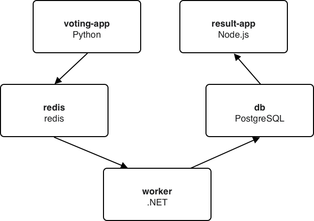

# Final App - Challange
======================

In this course, we have covered a breadth of Kubernetes objects that can
be used to run a full stack application. In this lab, we are going to
put all the pieces together to practice the concepts that were covered
and fill in any gaps along the way. To that end, this lab will **not**
present a step-by-step walkthrough of creating the Kubernetes objects,
but rather provide high-level project details that suggest which objects
to use.

General Guidelines for the Project Lab
--------------------------------------

By now, we have seen much of the versatility and capability of the
`kubectl` utility. However, recall from a previous lab that `kubectl`
provides a great depth of helpful documentation straight from the
command-line. In this project lab, the suggested syntax to use to access
the included documentation includes:

-   `kubectl --help | grep -i <topic>`
-   `kubectl <sub-command> --help`
-   `kubectl explain <cluster object>`

Additionally, a time-saving step with respect to creating YAML manifests
is having the Kubernetes client generate the YAML that creates the
cluster object into a file, then modify the fields as needed. For
example,

``` 
ubuntu@master:~$ kubectl create deploy nginx \
    --image=nginx --dry-run=client -o yaml > nginx-deployment.yaml
```

Of course, the [Kubernetes Documentation
site](https://kubernetes.io/docs/home/) is an excellent source to get
reference YAML object syntax.

One last guideline, in your planning phase of the project, focus your
efforts on using just enough Kubernetes objects to achieve the goal of
this project.

Project Lab: Description
------------------------

Your manager has asked you to port an existing Docker Swarm application
to Kubernetes. You can find the Swarm YAML file
[HERE](https://github.com/docker-training/example-voting-app/blob/master/docker-stack-simple.yml).
Use Kubernetes Compute, Network, and Storage objects in your
implementation. The specific implementation objects must include
minimally the following Kubernetes objects:

-   PersistentVolume
-   PersistentVolumeClaim
-   Deployment
-   Service (ClusterIP and NodePort at least)
-   ConfigMap
-   Secret

The project implementation *should follow* best practices that have been
discussed throughout this course. As an overall guidance in porting this
project please keep in mind that Swarm services find each other using
Swarm’s built-in DNS. Hence, when porting to Kubernetes we can replace
the Swarm service with a Kubernetes Service with the same name,
listening on the same port, and any application using DNS service
discovery should continue to behave the same - i.e. do not change the
service names.

Project Lab: Getting Started
----------------------------

A good first step is to review the existing Docker Swarm deployment and
gather requirements.

The `Example Voting App` is a popular Docker training application, which
we are going to use to continue developing our Kubernetes skills. The
application is composed of five component apps, each of which is a
containerized application you can pull from Docker Hub. The components
interaction is depicted in the following image:



-   A Python web application which lets you vote between two options
-   A Redis queue which collects new votes
-   A .NET worker which consumes votes and stores them in a database
-   A PostgreSQL database backed by a Docker volume
-   A Node.js web application which shows the results of the voting in
    real time


Project Lab: Task List
----------------------

The following are a high-level steps to follow as you work on deploying
the `voting-app` to Kubernetes. If at any time you need assistance, then
please reach out to your instructor.

Step 1: Create a `PersistentVolume` of type `hostPath` and size of
`100Mi`.

Step 2: Create a `PersistentVolumeClaim` with `accessMode` of read and
write of size `80Mi`.

Step 3: Create a Deployment with one replica using the container image
`postgres:9.4` and use the PVC from step two for the database. HINT:
Ensure you follow best practice for application configuration.

Step 4: Create a Service for the PostgreSQL deployment which targets TCP
port `5432`.

Step 5: Create a Deployment with one replica using the container image
`redis:alpine` and an open TCP port `6379`.

Step 6: Create a Service for the `redis` Deployment which targets TCP
port `6379`.

Step 7: Create a Deployment with one replica using the image
`training/voting-worker:v1`

Step 8: Create a Deployment with two replicas using the image
`training/voting-app:v1`

Step 9: Create a Service that is backed by the `voting-app` pods (HINT:
Service must be able to route external cluster traffic).

Step 10: Create a Deployment with one replica using the image
`training/voting-result:v1`.

Step 11: Create a Service that is backed by the `voting-result` pod
(HINT: Service must be able to route external cluster traffic).

Step 12: Test your solution by accessing the `voting-result` and
`voting-app` web applications from your local browser.

Conclusion
----------

This project lab provides additional practice to put together all the
concepts covered in this training course. There are many solutions to
this project lab, and certainly, the lab can be modified to increase the
level of complexity of the Kubernetes solution (i.e. multi-container
pods, Ingress objects, StorageClasses, etc.) Yet, the guiding principle
for getting started with Kubernetes is this: consider your end goal,
then work towards using just enough Kubernetes to achieve it (no more,
no less).
